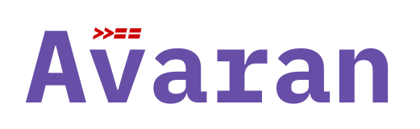

<h3>Alluring Monads for Javascript</h3>

> Monad transformers are also wip

Avaran is a library which provides implementations of many widely used monads in functional programming languages such as `Haskell`, `F#` etc in Javascript.